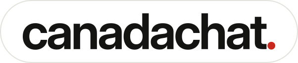
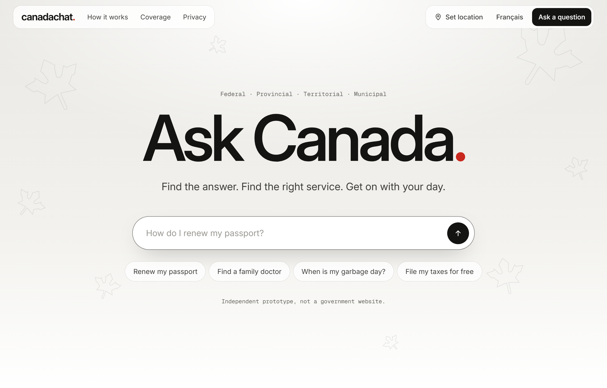
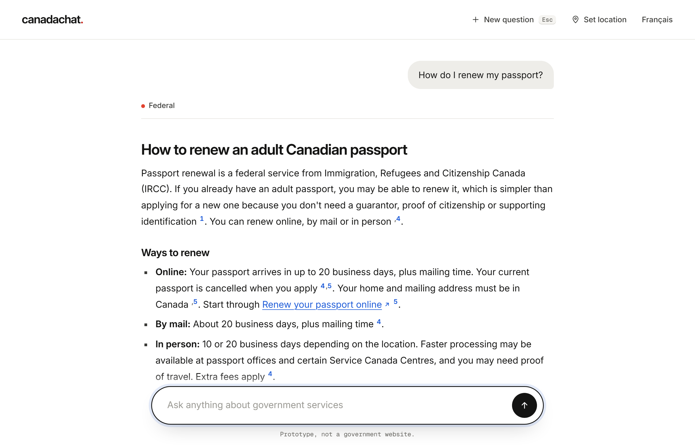
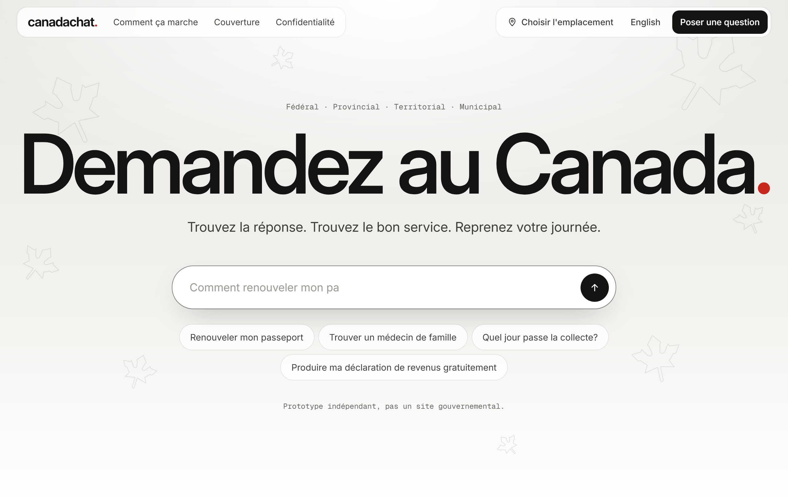
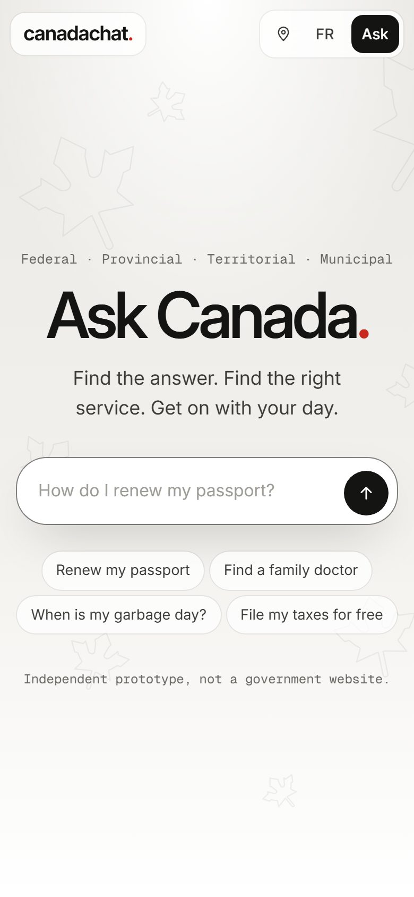

  

<h3 align="center">Ask Canada. Find the answer. Find the right service. Get on with your day.</h3>

  One place for everything people in Canada need from government. Describe what you need in plain words
  and canadachat answers from official federal, provincial, territorial and municipal sources, shows where
  each answer comes from, and sends you straight to the right service, form or application.

> canadachat is an independent prototype. It is not affiliated with the Government of Canada or any
> provincial, territorial or municipal government.

  

## What it does

* **Ask anything, in your own words.** "We're having a baby in Ontario, what do we apply for?" · "How do I
  get a health card in Alberta?" · "When is garbage day?" · "How long does a study permit take?" · "Who is my
  MP?" In English or French.
* **You can see where the answer comes from.** Every answer is built from official government pages, with
  numbered links back to the exact page and the date it was last updated.
* **Straight to the service.** Each answer ends with the official application, sign-in, booking or form you
  need, chosen from a curated catalog of more than 1,700 services across every level of government.
* **Knows which government does what.** Federal, all 13 provinces and territories, and major cities. Set your
  location once, or just mention it in your question.
* **Live lookups.** Your MP, provincial representative, mayor and councillor from a postal code, and current
  immigration processing times.
* **Private by design.** No account. Your location is saved only in your browser. Identifiers such as a SIN
  or health card number are removed before a question is sent to an AI model, and canadachat doesn't store
  your questions or answers.
* **Built to do more than point.** The same design that routes you to a service is the foundation for
  completing it with you (see "Where it's going" below).

  

## Status

canadachat is being prepared for launch at **[canadachat.ca](https://canadachat.ca)**. The source code is
being readied for public release and will be published in this repository soon, under the MIT licence.

Until then, this repository holds the project description, the brand assets in `media/`, and the issue
templates below.

## Where it's going

Today canadachat finds the answer and takes you to the right official service. The next step is for it to
do the task with you, and eventually for you:

* **Fill it in for you.** Draft the form or report from what you've already told it, then hand it to the
  official service for you to check and submit.
* **Take care of the paperwork.** Change your address with every government that needs to know, update a
  business's registered address, renew a licence, file a routine report.
* **Keep you posted.** Check the status of an application and tell you when something needs your attention.

Always through official channels, with your explicit go-ahead for each action, and without canadachat
keeping your identifiers. That's the road from "here's the page" to "done".

## Help make it better

The most useful thing you can send is a real case:

* **Wrong or missing answer**: what you asked, what it said, and the official page that has the right
  information.
* **Missing service**: a government service that should be offered as a next step, with its official page.
* **Bug**: something that doesn't work, on any device.
* **A task you'd like done for you**: which government chore you'd hand over first, and what would make you
  trust it.

Use the issue templates on the Issues tab. Security concerns go through private vulnerability reporting
(see `SECURITY.md`), not public issues.

  
  &nbsp;&nbsp;
  

## Licence

The code will be released under the MIT licence (see `LICENSE`). The name "canadachat", the "canadachat."
wordmark and the leaf icon are not covered by that licence. Government content shown by canadachat remains
the copyright of the publishing governments.
